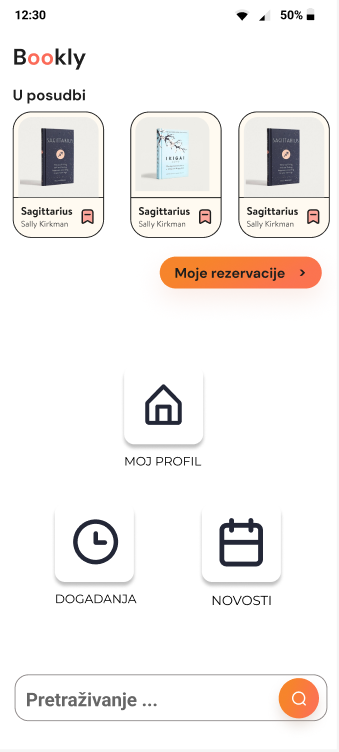

# Project Bookly (Moderna knjižnica)

## Projektni tim

Ime i prezime | E-mail adresa (FOI) | JMBAG | Github korisničko ime | Seminarska grupa
------------  | ------------------- | ----- | --------------------- | ----------------
Fran Kundih| fkundih21@foi.hr | 0016153545 | fkundih21 | G2
Marko Peša | mpesa21@foi.hr | 0016155209 | mpesa21 | G2
Matija Sinovčić| msinovcic21@foi.hr | 0016157016 | msinovcic21 | G2

## Opis domene
U ovome projektu bavimo se razvojem mobilne aplikacije koja bi povezivala korisnike knjižnice sa knjižnjicom preko pametnih uređaja. Ona će korisnicima omogućiti pregled kataloga knjiga knjižnice, rezervaciju knjiga, produženje roka posudbe, praćenje pročitanih knjiga, pružanje preporuka djela za sljedeću posudbu te obavijesti o događajima u knjižnici. Aplikacija će biti korisna njezinim klijentima te osoblju koje je zaposleno u knjižnici.

### Skica Home Screena

 
## Specifikacija projekta

Oznaka | Naziv | Kratki opis | Odgovorni član tima
------ | ----- | ----------- | -------------------
F01 | Login | Za pristup aplikaciji korisnik pri ulasku u aplikaciju mora upisati svoje login podatke koji se sastoje od korisničkog imena i lozinke. Korisniku nije moguć ulazak u aplikaciju ukoliko nije autentificiran.  | Matija Sinovčić
F02 | Pregled kataloga knjiga | Omogućuje korisnicima pregled dostupnih knjiga unutar knjižnice putem jednostavnog i intuitivnog sučelja | Matija Sinovčić
F03 | Rezervacija knjiga |Sustav pruža mogućnost korisnicima da rezerviraju knjige iz kataloga. Nakon što korisnik izvrši rezervaciju određene knjige, sustav automatski smanjuje dostupnost te knjige u katalogu. Ova funkcionalnost osigurava da druge osobe neće moći rezervirati istu knjigu dok je korisnikova rezervacija aktivna. To pomaže u održavanju reda i pravednog pristupa knjigama, a također omogućava korisnicima da budu sigurni da će imati pristup odabranoj knjizi kad dođu u knjižnicu. Ova automatska obrada dostupnosti olakšava i poboljšava upravljanje knjižničkim resursima. | Matija Sinovčić
F04 | Produženja roka posudbe | Sustav omogućuje korisnicima produženje roka posudbe knjiga, pružajući im fleksibilnost u upravljanju vremenom čitanja. Korisnici mogu jednostavno pristupiti svojim posuđenim knjigama putem aplikacije, a zatim odabrati željene knjige za produženje. Sustav automatski provjerava relevantne uvjete, kao što su dostupnost knjige, status korisničkog računa i broj prethodnih produženja. Ako su uvjeti ispunjeni, produženje roka posudbe odobrava se automatski, čime se korisnicima omogućuje duže zadržavanje knjiga. Ova funkcionalnost doprinosi boljem iskustvu korisnika i omogućava im da uživaju u čitanju knjiga s manje pritiska i ograničenja | Marko Peša
F05 | Praćenje pročitanih knjiga |Sustav korisnicima omogućuje označavanje i praćenje knjiga koje su već pročitali. Ova funkcionalnost omogućuje korisnicima da jednostavno označe knjige koje su dovršili ili pročitali kako bi očuvali popis svojih čitanja i vodili evidenciju o svojim literarnim interesima. Korisnici obično označavaju knjige kao "pročitane" ili ih dodaju u svoju digitalnu knjižnicu kako bi ih kasnije mogli pregledavati. | Fran Kundih
F06 | Preporuke za sljedeću posudbu | Sustav koristi povijest pročitanih knjiga korisnika kako bi im pružio personalizirane preporuke i temeljem kategorije pronalazi slične knjige. Na temelju knjiga koje su korisnici označili kao pročitane, sustav analizira njihove preferencije i interese. Koristi ovu povijest čitanja kako bi prepoznao obrasce i obrasce interesa korisnika.  | Fran Kundih
F07 | Prikaz događaja u knjižnici | Sustav prikazuje korisnicima obavijesti o događajima, predavanjima ili promocijama unutar knjižnice kako bi ih informirao o relevantnim zbivanjima i prigodama. Ova funkcionalnost omogućuje knjižnici da komunicira s članovima svoje zajednice i promovira svoje usluge  | Marko Peša
F08 | Ocjena knjige | Sustav omogućuje korisnicima dodavanje ocjena i pisanje recenzija za knjige koje su pročitali. Ova funkcionalnost omogućuje korisnicima da izraze svoje mišljenje o knjigama i podijele svoje recenzije s ostalim članovima zajednice  | Marko Peša
F09 | Lista čekanja | Ukoliko knjiga koju želimo posuditi nije dostupna u tom trenutku, istu knjigu možemo staviti na listu čekanja, te nakon što knjiga bude ponovno dostupna za posudbu korisnik dobiva obavijest o dostupnosti te je onda može posuditi. | Fran Kundih

## Tehnologije i oprema
1. **Programski jezik**
   -Kotlin
2. **Razvojno okruženje**
   -Android studio  
3. **Baza podataka**
   -SQL server managment studio
   -SQLite?
5. **Dizajn**
   -Adobe Photoshop
   -Figma
   

## Baza podataka i web server
Trebamo bazu podataka u kojoj ćemo pohranjivati podatke poput knjiga, ocjena, komentara, podataka korisnika...

## .gitignore
Uzmite u obzir da je u mapi Software .gitignore konfiguriran za nekoliko tehnologija, ali samo ako će projekti biti smješteni direktno u mapu Software ali ne i u neku pod mapu. Nakon odabira konačne tehnologije i projekta obavezno dopunite/premjestite gitignore kako bi vaš projekt zadovoljavao kriterije koji su opisani u ReadMe.md dokumentu dostupnom u mapi Software.
